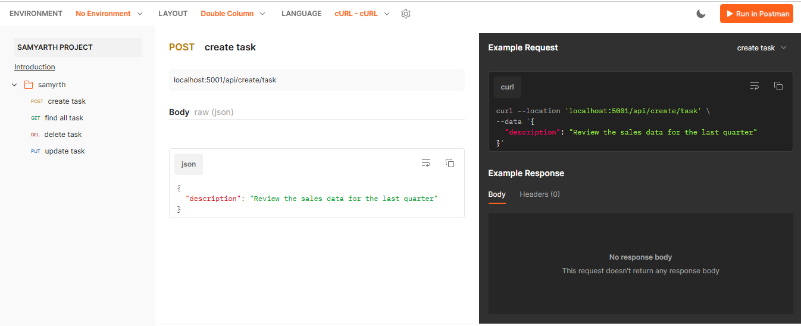
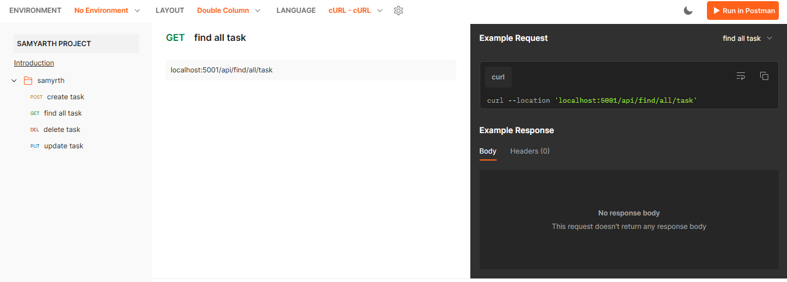
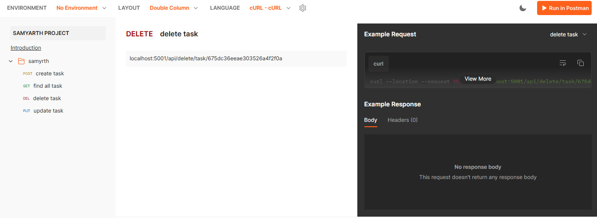
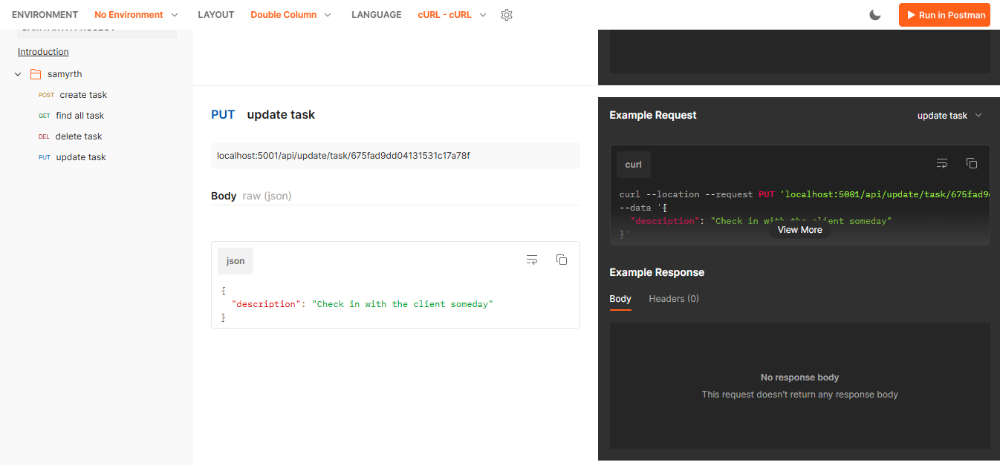
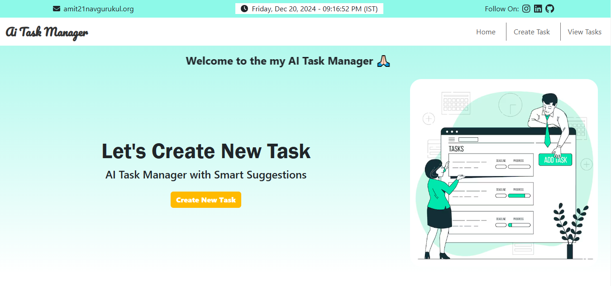
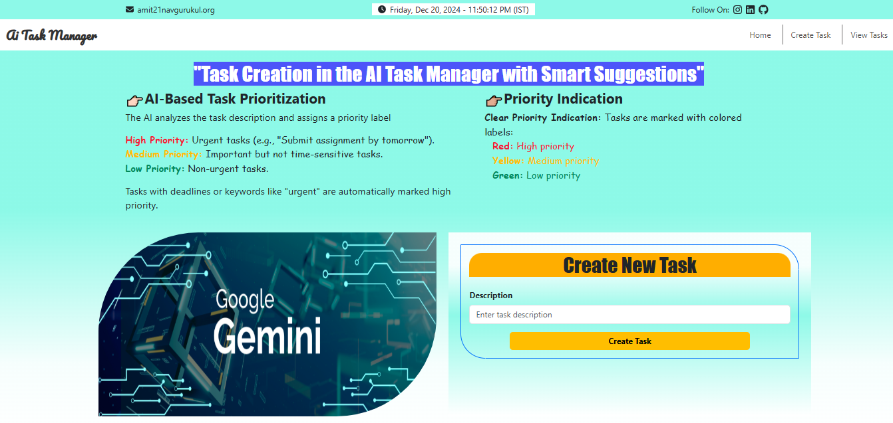
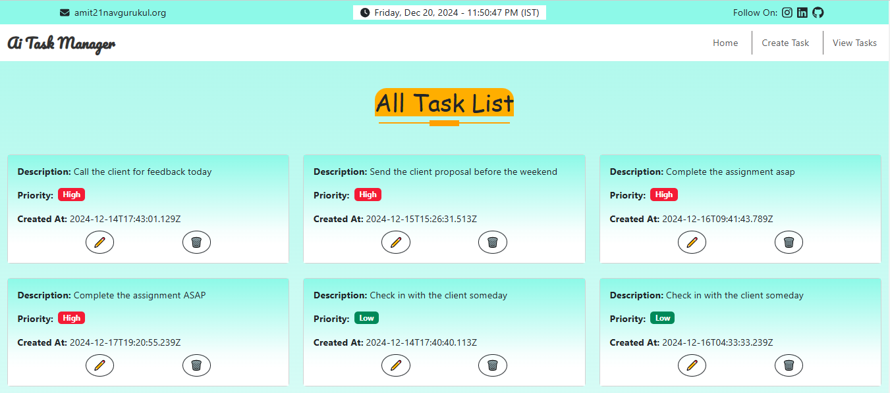
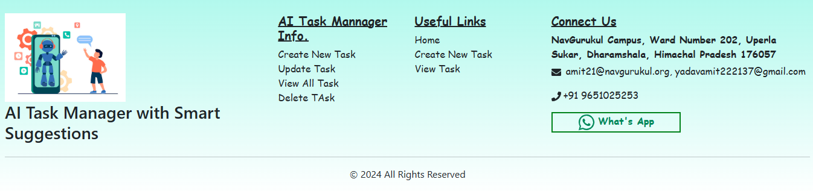
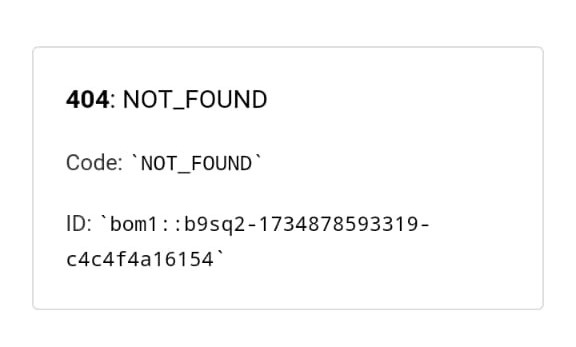

- [**🏷️ Project Name: Task Management App**](#️-project-name-task-management-app)
  - [📖 Project Overview](#-project-overview)
    - [AI Task Manager with Smart Suggestions](#ai-task-manager-with-smart-suggestions)
    - [✨ Essential Features:](#-essential-features)
    - [📝 Evaluation Criteria:](#-evaluation-criteria)
  - [🛠️ How many technologies used in this Task Management App backend. Here is a list of the main technologies:](#️-how-many-technologies-used-in-this-task-management-app-backend-here-is-a-list-of-the-main-technologies)
- [***👉🏼Backend Project Information***](#backend-project-information)
  - [📂 Folder structure of backend](#-folder-structure-of-backend)
  - [⚙️ Setup Instructions](#️-setup-instructions)
    - [Prerequisites](#prerequisites)
    - [Install Dependencies](#install-dependencies)
    - [Environment Variables](#environment-variables)
  - [🚀 Running the Application](#-running-the-application)
    - [Components:](#components)
    - [Important Notes:](#important-notes)
  - [📋 Priority Keywords List High, Medium, Low](#-priority-keywords-list-high-medium-low)
  - [🌐 API Endpoints 🔗](#-api-endpoints-)
    - [`POST /api/create/task`](#post-apicreatetask)
    - [`PUT /api/update/task/:id`](#put-apiupdatetaskid)
    - [`DELETE /api/delete/task/:id`](#delete-apideletetaskid)
    - [`GET /api/find/all/task`](#get-apifindalltask)
  - [When there is an error in the routes ⚠️❌](#when-there-is-an-error-in-the-routes-️)
  - [🔗 Samyarth Project Postman Documentation Link](#-samyarth-project-postman-documentation-link)
  - [Postman Documentation](#postman-documentation)
      - [Postman Collection](#postman-collection)
      - [Postman Collection(Create API)](#postman-collectioncreate-api)
      - [Postman Collection(Find All API)](#postman-collectionfind-all-api)
      - [Postman Collection(Delete API)](#postman-collectiondelete-api)
      - [Postman Collection(Update API)](#postman-collectionupdate-api)
  - [📜 Backend Project Deployment Information](#-backend-project-deployment-information)
  - [🔗 How to connect the backend with the frontend](#-how-to-connect-the-backend-with-the-frontend)
    - [**Set Up CORS (Cross-Origin Resource Sharing)** in Backend](#set-up-cors-cross-origin-resource-sharing-in-backend)
- [***👉 Frontend Project Information***](#-frontend-project-information)
  - [Install Dependencies](#install-dependencies-1)
  - [How many Dependencies use in frontend](#how-many-dependencies-use-in-frontend)
  - [How to start frontend server](#how-to-start-frontend-server)
  - [Frontend Deployed Link](#frontend-deployed-link)
    - [**The frontend is live and accessible at the following link 👉🏿**](#the-frontend-is-live-and-accessible-at-the-following-link-)
  - [Visual Overview of the Application](#visual-overview-of-the-application)
    - [Home Page](#home-page)
    - [Create New Task Page](#create-new-task-page)
    - [View Task Page](#view-task-page)
    - [Footer Page](#footer-page)
  - [Fixing React Routing Issues on Page Refresh After Deploying to Vercel](#fixing-react-routing-issues-on-page-refresh-after-deploying-to-vercel)
    - [Getting page refresh error](#getting-page-refresh-error)
    - [Solution](#solution)

---

# **🏷️ Project Name: Task Management App**
## 📖 Project Overview
### AI Task Manager with Smart Suggestions
Description: A task management app where users can add tasks, and AI suggests task priorities or action items based on the description.

### ✨ Essential Features:

1. **Add, View, Edit, and Delete Tasks**  
   You can:  
   - Add new tasks (e.g., finish homework, buy groceries).  
   - View your list of tasks.  
   - Edit tasks if something changes.  
   - Delete tasks when you’re done with them.

2. **AI-based Task Prioritization**  
   When you add a task, the AI will analyze the task description (e.g., "Complete assignment by Friday") and label the task based on urgency:  
   - **High priority**: Urgent or important tasks (e.g., deadlines).  
   - **Medium priority**: Important but not urgent.  
   - **Low priority**: Tasks that can be done later.

### 📝 Evaluation Criteria:

1. **Task Operations (CRUD)**  
   a. Create tasks➕.  
   b. Display tasks👀.  
   c. Update tasks✏️.  
   d. Delete tasks❌. Each action should be updated in real-time without errors.

2. **AI Suggestions for Prioritization**  
   The AI must provide reasonable priority suggestions (High, Medium, Low) based on the task description. For example, tasks with deadlines should be marked high priority.

3. **User Interface (UI)**  
   a. The task list should show tasks in order of priority.  
   b. You can reorder tasks manually if needed.  
   c. The priority of each task should be clearly visible (e.g., colored labels like red for high, yellow for medium, and green for low).


Note : This project provides the backend for the Task Management application. It handles task creation, updates, deletion, and priority assignment using Google Gemini AI.

## 🛠️ How many technologies used in this Task Management App backend. Here is a list of the main technologies:

1. **Node.js** - Server-side JavaScript runtime environment for building the backend.
2. **Express.js** - Web framework for Node.js to handle HTTP requests and routes.
3. **MongoDB** - NoSQL database used to store task data.
4. **Mongoose** - ODM (Object Data Modeling) library for MongoDB, used to interact with the database.
5. **Google Gemini AI** - AI tool for generating task priorities based on the task description.
6. **Postman** - Tool used for API testing and documentation.
7. **dotenv** - For managing environment variables in the backend.
8. **express-validator** - A set of middleware functions used in Express.js for validating and sanitizing incoming requests to ensure data integrity and correct input formats.
9. **.gitignore** - A configuration file used in Git to specify which files or directories should be ignored by version control.
---
# ***👉🏼Backend Project Information***

This project provides the backend for the Task Management application. It handles task creation, updates, deletion, and priority assignment using Google Gemini AI.

---

## 📂 Folder structure of backend
```markdown
/Backend
├── /controllers
│   └── taskController.js        # Controller containing task-related logic (create, find, update, delete)
├── /databaseConnection
│   └── db.js                   # Database connection logic to MongoDB
├── /geminiAI
│   └── ai.js                   # Integration with Gemini AI for generating task priority
├── /middleware
│   ├── errorHandler.js         # Global error handler for managing task-related errors
│   ├── handleValidationErrors.js # Middleware to handle and format validation errors
│   ├── logger.js               # Custom middleware for logging request and response data
│   └── notFoundHandler.js      # Middleware for handling routes that are not found
├── /mongoDBSchema
│   └── taskSchema.js           # Mongoose schema definition for Task model
├── /routers
│   └── taskRoutes.js           # Routes and route handlers for task-related operations
├── /validators
│   └── taskValidation.js       # Validation logic for validating task-related requests
├── .env                        # Environment variables (e.g., MongoDB URI, Gemini API key)
├── .gitignore                  # Git ignore file specifying files/folders to be excluded from version control
├── package.json                # Project dependencies, scripts, and configurations
├── server.js                   # Main server entry point for the backend application
└── README.md                   # Project documentation for setting up and using the application

```
Note : It uses **MongoDB** for storing data and **Express.js** for handling HTTP requests. The AI model (Google Gemini) is used for assigning task priority based on the description.

---

## ⚙️ Setup Instructions

### Prerequisites

Ensure you have the following installed:
- **Node.js**: [Install Node.js](https://nodejs.org/)
- **MongoDB**: [Install MongoDB](https://www.mongodb.com/try/download/community) or use a cloud solution like [MongoDB Atlas](https://www.mongodb.com/cloud/atlas)

### Install Dependencies

1. How to Install project dependencies in Node.js:

   ```markdown
   npm install dependencies_name
   ```

### Environment Variables

Create a `.env` file in the root of the `backend` folder and add the following keys:

```
MONGO_URI=your_mongo_connection_string
GEMINI_API_KEY=your_google_gemini_api_key
PORT=5001
```

- **MONGO_URI**: MongoDB connection string for your database.
- **GEMINI_API_KEY**: Google Gemini API key for priority generation.
- **PORT**: Port on which the server will run.

---

## 🚀 Running the Application

To start the backend server, run the following command:

```
node --watch server.js
```
The command `node --watch server.js` is used to run a Node.js server while enabling **watch mode**. Here’s a detailed breakdown of the command:

### Components:
1. **`node`**:
   - This is the command-line interface for running JavaScript code using Node.js. When you type `node server.js`, you are running the `server.js` JavaScript file using Node.js.

2. **`--watch`** (or **`-w`**):
   - This flag tells Node.js to enable **watch mode**. When watch mode is active, Node.js will automatically detect file changes and restart the server when any changes are made to your JavaScript files.

3. **`server.js`**:
   - This is the file that contains the main logic of your application (in this case, likely your Express.js server). It’s the file that Node.js will execute to start the server.

### Important Notes:
- **Node.js 18+**: The `--watch` flag is available starting from Node.js version 18. If you are using an older version of Node.js, you may not have this functionality.

This will start the application on the specified port (default is `5001`).

---
## 📋 Priority Keywords List High, Medium, Low
1. **High Priority (Urgent or Immediate):**
   - today, tomorrow, urgent, asap / ASAP, immediately, right now, deadline, by end of the day, due soon  
   - Specific timeframes: "in 1 hour", "by 5 PM", etc.

2. **Medium Priority (Important but Not Urgent):**
   - this week, next week, upcoming, prepare for, later this week, by Monday/Tuesday (specific days, but not urgent), before next month, within a few days

3. **Low Priority (Can Be Done Later):**
    - sometime, next month, next year, eventually, whenever, plan for, future, long term, someday  
---

## 🌐 API Endpoints 🔗

Here are the main API endpoints for task management:

### `POST /api/create/task`

- **Description**: Creates a new task with a description and priority (generated using AI).
- **Body**:
  ```json
    {
    "description": "Complete the assignment ASAP"
    }
  ```
- **Response**:
  ```json
    {
        "message": "Task created successfully",
        "task": {
            "description": "Complete the assignment ASAP",
            "priority": "High",
            "_id": "675ff40427b2d9ea58934823",
            "createdAt": "2024-12-16T09:33:56.520Z",
            "__v": 0
        }
    }
  ```
---

### `PUT /api/update/task/:id`

- **Description**: Updates a task's description and recalculates priority based on the updated description.
- **URL Parameter**: `id` (MongoDB ObjectId)
- **Body**:
  ```json
    {
    "description": "Complete the assignment asap"
    }
  ```
- **Response**:
  ```json
    {
        "message": "Task updated successfully",
        "task": {
            "_id": "675ff5d727b2d9ea58934827",
            "description": "Complete the assignment asap",
            "priority": "High",
            "createdAt": "2024-12-16T09:41:43.789Z",
            "__v": 0
        }
    }
  ```
---

### `DELETE /api/delete/task/:id`

- **Description**: Deletes a task by its ID.
- **URL Parameter**: `id` (MongoDB ObjectId)
- **Response**:
  ```json
    {
        "message": "Task deleted successfully",
        "task": {
            "_id": "675ff40427b2d9ea58934823",
            "description": "Complete the assignment ASAP",
            "priority": "High",
            "createdAt": "2024-12-16T09:33:56.520Z",
            "__v": 0
        }
    }
  ```
---
### `GET /api/find/all/task`

- **Description**: Fetches details of all tasks.
- **Response**:
  ```json
    [
        {
            "_id": "675dc38deae303526a4f2f0e",
            "description": "Complete the design draft by the end of the week",
            "priority": "High",
            "createdAt": "2024-12-14T17:42:37.558Z",
            "__v": 0
        },
        {
            "_id": "675dc3a5eae303526a4f2f10",
            "description": "Call the client for feedback today",
            "priority": "High",
            "createdAt": "2024-12-14T17:43:01.129Z",
            "__v": 0
        }
    ]
  ```
  ---

## When there is an error in the routes ⚠️❌
- **A) When the correct API path is not provided for the create, update, view/find/get, or delete task routes**
  ```json
    {
    "message": "Router Path Not Found. Please check it."
    }
  ```

- **B) When there is an error in the route**
  - **When the correct task ID is not provided in delele route**
    - **req.params.id** : localhost:5001/api/delete/task/232jaj
    - **Response**
    ```json
      {
          "errors": [
              {
                  "value": "232jaj",
                  "field": "id",
                  "msg": "Task ID must be a valid MongoDB ObjectId"
              }
          ]
      }
    ```

  - **When trying to delete the same ID that has already been deleted**
    - **req.params.id** : localhost:5001/api/delete/task/675dc36eeae303526a4f2f0a
    - **Response**
    ```json
        {
            "message": "Task not found"
        }
    ```
    ---
  - **When the correct task ID is not provided in update route**
    - **req.params.id** : localhost:5001/api/update/task/675ff5d727b2d9ea58934827adasda
    - **Response**
    ```json
      {
          "errors": [
              {
                  "value": "675ff5d727b2d9ea58934827adasda",
                  "field": "id",
                  "msg": "Task ID must be a valid MongoDB ObjectId"
              }
          ]
      }
    ```

- **C) When a request is sent without a description**
  - **When a request is sent to the create or update API without a description**
    - **Create Request URL** : localhost:5001/api/create/task
    - **Update Request URL** : localhost:5001/api/update/task/675ff5d727b2d9ea58934827
    - **Body** : {}
    - **Response**
      ```json
        {
            "errors": [
                {
                    "field": "description",
                    "msg": "Description field is required"
                },
                {
                    "field": "description",
                    "msg": "Description must be a string"
                }
            ]
        }
      ```
---

## 🔗 Samyarth Project Postman Documentation Link
<p align="center">
  <a href="https://documenter.getpostman.com/view/22765203/2sAYHzFhxV" target="_blank" style="text-decoration: none;">
    
  </a>
</p>

## Postman Documentation
#### Postman Collection
 

#### Postman Collection(Create API)


#### Postman Collection(Find All API)
 

#### Postman Collection(Delete API)


#### Postman Collection(Update API)


---

## 📜 Backend Project Deployment Information
- **Backend deployment process on Vercel setup**
  - First, create a `vercel.json` file inside the backend folder, and then use this code:
  ```json
  {
      "version": 2,
      "builds": [
          {
              "src": "server.js",
              "use": "@vercel/node"
          }
      ],
      "routes": [
          {
              "src": "/(.*)",
              "dest": "/server.js"
          }
      ] 
  }
  ```

  - Afterward, add the following script inside the `package.json` file:
  ```json
  "scripts": {
      "dev": "node --watch server.js",
      "build": "node server.js",
      "vercel-build": "echo hello"
  }
  ```
  This sets up the necessary configuration for deploying the backend on Vercel.

- **Backend Deployment Live Link for "Find All Task" API**
- 
  ```markdown
  https://samyarth-project.vercel.app/api/find/all/task

  ```

## 🔗 How to connect the backend with the frontend
To connect the backend to the frontend, follow these steps:

### **Set Up CORS (Cross-Origin Resource Sharing)** in Backend

Install the `cors` middleware and configure it to allow requests from the frontend domain.
CORS allows your frontend (which runs on a different port or domain) to interact with your backend API. Here's how to enable it:

- Install `cors` middleware in your backend:

  ```bash
  npm install cors
  ```

- In our `server.js` (or main backend file), enable CORS:

  ```javascript
  import cors from 'cors';

  // Enable CORS for frontend URL
  const corsOptions = {
      origin: true, // Wrap the URL in quotes
      optionsSuccessStatus: 200,       // For legacy browser support
      credentials: true,               // Allow credentials like cookies
      methods: 'GET,POST,PUT,DELETE',  // Allowed HTTP methods
  };
  app.use(cors(corsOptions));

# ***👉 Frontend Project Information***
## Install Dependencies
How to Install project dependencies in Frontend

- `npm install dependencies_name`

## How many Dependencies use in frontend
`bootstrap`, `axios`, `react-bootstrap`, `react-icons`, `react-toastify`, `react-router-dom`

## How to start frontend server
- **start server :** npm run dev

## Frontend Deployed Link
### **The frontend is live and accessible at the following link 👉🏿**
<p align="center">
  <a href="https://samyarth-project-7q7s.vercel.app/" target="_blank" style="text-decoration: none;">
    
  </a>
</p>


## Visual Overview of the Application
### Home Page


### Create New Task Page


### View Task Page


### Footer Page


## Fixing React Routing Issues on Page Refresh After Deploying to Vercel
### Getting page refresh error


This error happens in React apps (Single Page Applications) when you refresh the page. It occurs because Vercel's server doesn't recognize the specific route, as React manages the routes in the browser.

### Solution
To fix this, you need to configure a custom `vercel.json` file to ensure that all routes are redirected to your `index.html` file, allowing React to handle routing.

1. **Go to the root directory** of your **frontend project** (where your `package.json` is located).

2. **Create or Update `vercel.json`:** Add a `vercel.json` file in the root directory of your project with the following content:
3. **Add the following content** to the `vercel.json` file:
4. **Re-deploy Your App:** After adding the `vercel.json` file, re-deploy your app to Vercel.
5. **Save** the file and redeploy your frontend to Vercel.

  ```json
   {
     "rewrites": [
       { "source": "/(.*)", "destination": "/" }
     ]
   }
