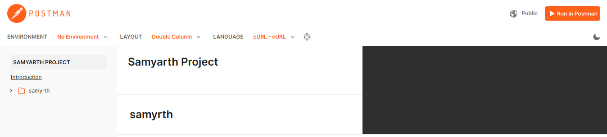

# Table of Contents

- [Table of Contents](#table-of-contents)
- [Project Name: Task Management App](#project-name-task-management-app)
  - [Project Overview](#project-overview)
    - [AI Task Manager with Smart Suggestions](#ai-task-manager-with-smart-suggestions)
    - [Essential Features:](#essential-features)
    - [Evaluation Criteria:](#evaluation-criteria)
  - [Folder structure of backend](#folder-structure-of-backend)
  - [Setup Instructions](#setup-instructions)
    - [Prerequisites](#prerequisites)
    - [Install Dependencies](#install-dependencies)
    - [Environment Variables](#environment-variables)
  - [Running the Application](#running-the-application)
    - [Components:](#components)
    - [Important Notes:](#important-notes)
  - [API Endpoints](#api-endpoints)
    - [`POST /api/create/task`](#post-apicreatetask)
    - [`PUT /api/update/task/:id`](#put-apiupdatetaskid)
    - [`DELETE /api/delete/task/:id`](#delete-apideletetaskid)
    - [`GET /api/find/all/task`](#get-apifindalltask)
  - [Samyarth Project Postman Documentation Link](#samyarth-project-postman-documentation-link)
  - [API Testing](#api-testing)

---

# Project Name: Task Management App
## Project Overview
### AI Task Manager with Smart Suggestions
Description: A task management app where users can add tasks, and AI suggests task priorities or action items based on the description.

### Essential Features:

1. **Add, View, Edit, and Delete Tasks**  
   You can:  
   - Add new tasks (e.g., finish homework, buy groceries).  
   - View your list of tasks.  
   - Edit tasks if something changes.  
   - Delete tasks when you’re done with them.

2. **AI-based Task Prioritization**  
   When you add a task, the AI will analyze the task description (e.g., "Complete assignment by Friday") and label the task based on urgency:  
   - **High priority**: Urgent or important tasks (e.g., deadlines).  
   - **Medium priority**: Important but not urgent.  
   - **Low priority**: Tasks that can be done later.

### Evaluation Criteria:

1. **Task Operations (CRUD)**  
   a. Create tasks.  
   b. Display tasks.  
   c. Update tasks.  
   d. Delete tasks. Each action should be updated in real-time without errors.

2. **AI Suggestions for Prioritization**  
   The AI must provide reasonable priority suggestions (High, Medium, Low) based on the task description. For example, tasks with deadlines should be marked high priority.

3. **User Interface (UI)**  
   a. The task list should show tasks in order of priority.  
   b. You can reorder tasks manually if needed.  
   c. The priority of each task should be clearly visible (e.g., colored labels like red for high, yellow for medium, and green for low).


Note : This project provides the backend for the Task Management application. It handles task creation, updates, deletion, and priority assignment using Google Gemini AI.

---

## Folder structure of backend
```markdown
/Backend
├── /controllers
│   └── taskController.js        # Controller containing task-related logic (create, find, update, delete)
├── /databaseConnection
│   └── db.js                   # Database connection logic to MongoDB
├── /geminiAI
│   └── ai.js                   # Integration with Gemini AI for generating task priority
├── /middleware
│   ├── errorHandler.js         # Global error handler for managing task-related errors
│   ├── handleValidationErrors.js # Middleware to handle and format validation errors
│   ├── logger.js               # Custom middleware for logging request and response data
│   └── notFoundHandler.js      # Middleware for handling routes that are not found
├── /mongoDBSchema
│   └── taskSchema.js           # Mongoose schema definition for Task model
├── /routers
│   └── taskRoutes.js           # Routes and route handlers for task-related operations
├── /validators
│   └── taskValidation.js       # Validation logic for validating task-related requests
├── .env                        # Environment variables (e.g., MongoDB URI, Gemini API key)
├── .gitignore                  # Git ignore file specifying files/folders to be excluded from version control
├── package.json                # Project dependencies, scripts, and configurations
├── server.js                   # Main server entry point for the backend application
└── README.md                   # Project documentation for setting up and using the application

```
Note : It uses **MongoDB** for storing data and **Express.js** for handling HTTP requests. The AI model (Google Gemini) is used for assigning task priority based on the description.

---

## Setup Instructions

### Prerequisites

Ensure you have the following installed:
- **Node.js**: [Install Node.js](https://nodejs.org/)
- **MongoDB**: [Install MongoDB](https://www.mongodb.com/try/download/community) or use a cloud solution like [MongoDB Atlas](https://www.mongodb.com/cloud/atlas)

### Install Dependencies

1. How to Install project dependencies in Node.js:

   ```markdown
   npm install dependencies_name
   ```

### Environment Variables

Create a `.env` file in the root of the `backend` folder and add the following keys:

```
MONGO_URI=your_mongo_connection_string
GEMINI_API_KEY=your_google_gemini_api_key
PORT=5001
```

- **MONGO_URI**: MongoDB connection string for your database.
- **GEMINI_API_KEY**: Google Gemini API key for priority generation.
- **PORT**: Port on which the server will run.

---

## Running the Application

To start the backend server, run the following command:

```
node --watch server.js
```
The command `node --watch server.js` is used to run a Node.js server while enabling **watch mode**. Here’s a detailed breakdown of the command:

### Components:
1. **`node`**:
   - This is the command-line interface for running JavaScript code using Node.js. When you type `node server.js`, you are running the `server.js` JavaScript file using Node.js.

2. **`--watch`** (or **`-w`**):
   - This flag tells Node.js to enable **watch mode**. When watch mode is active, Node.js will automatically detect file changes and restart the server when any changes are made to your JavaScript files.

3. **`server.js`**:
   - This is the file that contains the main logic of your application (in this case, likely your Express.js server). It’s the file that Node.js will execute to start the server.

### Important Notes:
- **Node.js 18+**: The `--watch` flag is available starting from Node.js version 18. If you are using an older version of Node.js, you may not have this functionality.

This will start the application on the specified port (default is `5001`).

---

## API Endpoints

Here are the main API endpoints for task management:

### `POST /api/create/task`

- **Description**: Creates a new task with a description and priority (generated using AI).
- **Body**:
  ```json
  {
    "description": "Task description here"
  }
  ```
- **Response**:
  ```json
  {
    "message": "Task created successfully",
    "task": {
      "id": "task_id",
      "description": "Task description here",
      "priority": "High"
    }
  }
  ```

### `PUT /api/update/task/:id`

- **Description**: Updates a task's description and recalculates priority based on the updated description.
- **URL Parameter**: `id` (MongoDB ObjectId)
- **Body**:
  ```json
  {
    "description": "Updated task description"
  }
  ```
- **Response**:
  ```json
  {
    "message": "Task updated successfully",
    "task": {
      "id": "task_id",
      "description": "Updated task description",
      "priority": "Medium"
    }
  }
  ```

### `DELETE /api/delete/task/:id`

- **Description**: Deletes a task by its ID.
- **URL Parameter**: `id` (MongoDB ObjectId)
- **Response**:
  ```json
  {
    "message": "Task deleted successfully",
    "task": {
      "id": "task_id",
      "description": "Deleted task description",
      "priority": "Low"
    }
  }
  ```

Here’s the corrected version of your `GET` API endpoint description:

### `GET /api/find/all/task`

- **Description**: Fetches details of all tasks.
- **Response**:
  ```json
  {
    "tasks": [
      {
        "id": "task_id",
        "description": "Task description",
        "priority": "High"
      },
      {
        "id": "another_task_id",
        "description": "Another task description",
        "priority": "Medium"
      }
    ]
  }
  ```

---

## Samyarth Project Postman Documentation Link
https://documenter.getpostman.com/view/22765203/2sAYHzFhxV

    

---
## API Testing
To test your API endpoints, you can use tools like [Postman](https://www.postman.com/).